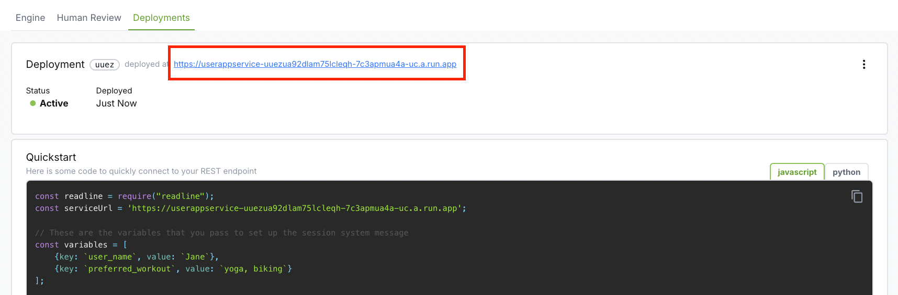

# Environment Variables

## Preventing Prompt Redeployment by Using Environment variables for API URLs

Redeploying an application can be costly—it takes time, risks breaking other components, and can cause downtime. With Big Hummingbird, all you need to change is the service URL to switch your prompt. Once you deploy your prompt (see [Deployment](../deployment/intro.md)), you'll see a service URL that you need to update in your app. Instead of redeploying your whole app for such a simple update, use environment variables to make the switch.


## How to Store API URLs in Environment Variables

### 1. Set Up the Environment Variable

Define the prompt service URL in an environment variable. If you're using a `.env` file, it looks something like this: 

```bash title=".env"
PROMPT_SERVICE_URL=https://userappservice-uuezua92dlam75lcleqh-7c3apmua4a-uc.a.run.app
```

### 2. Use It in Your Code

Access the URL through an environment variable using a tool like `dotenv` (for Node.js)

**Install dotenv**:
```bash
npm install dotenv
```

**app.js**:
```javascript
require('dotenv').config();
const promptServiceUrl = process.env.PROMPT_SERVICE_URL;
```

3. Switch service url without redeployment

Just change the `.env` file or adjust the variable in your hosting provider's settings (e.g. AWS, Docker). This way, you switch the prompts instantly without having to rebuild or redeploy the entire application. 

## Example: Deploying to the Cloud

- **AWS Lambda**: Configure `PROMPT_SERVICE_URL` in the environment variables section. 
- **Docker**: Use `-e` to set the variable when running: 
```bash
docker run -e PROMPT_SERVICE_URL=https://userappservice-uuezua92dlam75lcleqh-7c3apmua4a-uc.a.run.app my-app
```

:::tip
Just a heads up: You'll still need to redeploy on Big Hummingbird's dashboard to get the new service URL. This is how you differentiate different prompt setups. But the good news is, with environment variables, you won't need to redeploy your app itself!
:::