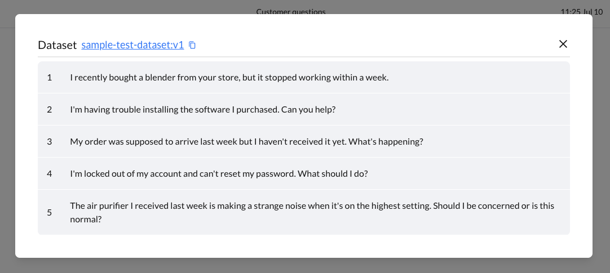

# Dataset

A "dataset" is a collection of input data points, arranged in an array, used to evaluate and test the performance and accuracy of a model. Think of it as a set of different test scenarios to see how well your model performs with various inputs. 

## Creating a new dataset
```python title="dataset.py"
from bighummingbird import BigHummingbird
from bighummingbird.dataset import Dataset
bhb = BigHummingbird("My customer support project", API_KEY)
customer_questions = [
    'I recently bought a blender from your store, but it stopped working within a week.',
    'I\'m having trouble installing the software I purchased. Can you help?',
    'My order was supposed to arrive last week but I haven\'t received it yet. What\'s happening?',
    'I\'m locked out of my account and can\'t reset my password. What should I do?',
    'The air purifier I received last week is making a strange noise when it\'s on the highest setting. Should I be concerned or is this normal?'
]
test_dataset = Dataset("test_dataset", description="Customer questions", data=customer_questions)
```
Upload the dataset by calling `upload_dataset`
```python title="dataset.py"
bhb.upload_dataset(test_dataset)
```
run the file
```bash
python dataset.py
✔ Project set to: My customer support project
✔ Dataset test_dataset:v1 created.
```

Awesome! Whenever you see this message, it means that your dataset has been uploaded to BigHummingbird successfully and you can view it in Project > Dataset. 
In this example, `test_dataset:v1` is called the dataset tag and it is a unique identifier to your dataset. 

```python
customer_questions = [
    'The vacuum cleaner I bought from your website isn\'t picking up dirt properly. Can I get a replacement?',
    'I ordered a pair of shoes but received the wrong size. How can I exchange them?',
    'The coffee maker I purchased is leaking water from the bottom. What should I do?',
    'I can\'t access the e-book I bought. Can you assist me with this issue?',
    'My wireless earbuds are not connecting to my phone. Is there a troubleshooting guide available?'
]
dataset = Dataset("sample-test-dataset", data=customer_questions, description="Customer questions")
dataset_tag = bighummingbird.upload_dataset(dataset)
```


## Automatic dataset tracking
### Dataset Detection
- **New Dataset**: If the dataset is new, BigHummingbird will automatically create it for you.
- **Existing Dataset**: If the dataset already exists, BigHummingbird will recognize it and won't create a duplicate.

## Dataset Tagging
- Each dataset is assigned a unique identifier called the **Dataset Tag**
- The format for a Dataset Tag is `{dataset_name}:{version}`
- Dataset tags are unique to each project, ensuring that each dataset can be distinctly identified within its respective project.
- If the `{dataset_name}` is updated, a new dataset tag will be created and start from version: `v1`

