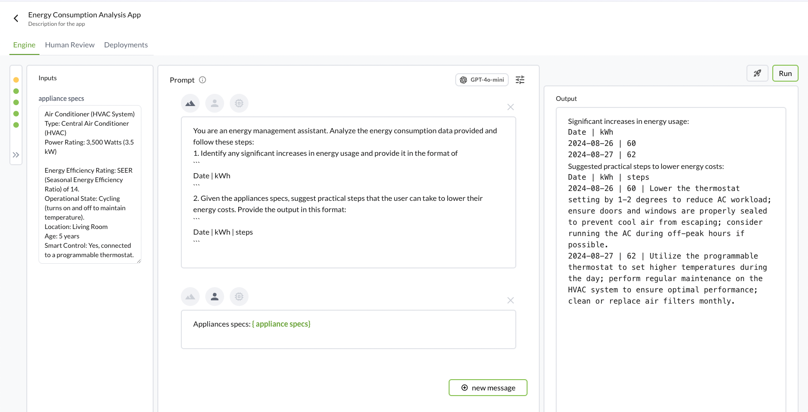
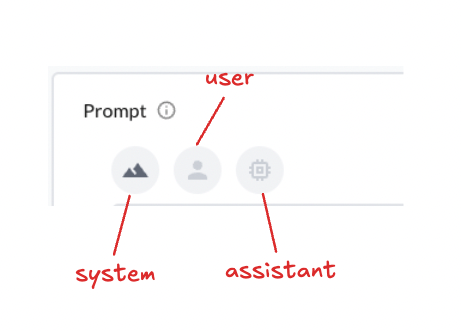
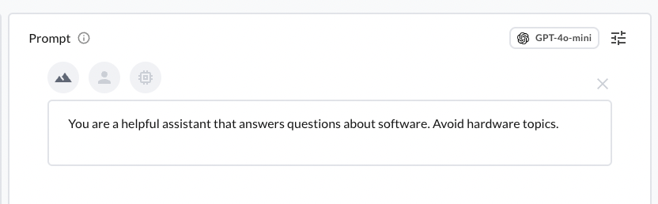
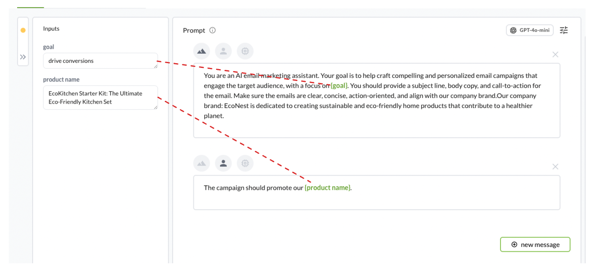
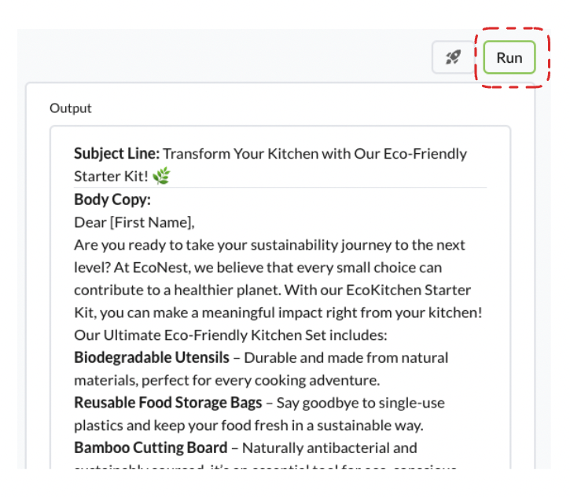

# Engine
Welcome to the Engine, your main workspace for managing prompts! It’s designed to keep everything organized and accessible with four key sections: prompts, inputs, model configuration, and outputs.

The engine contains 4 main sections:
- prompts
- inputs
- model configuration
- outputs



## Prompt Section

### Role Types in Conversational AI
In a conversational AI system, interactions are categorized into three distinct roles: **system**, **user**, and **assistant**.

- *System Role:* Tells the assistant how to act.
- *User Role:* Represents the human asking the question.
- *Assistant Role:* This is the AI's response based on the system's rules and the user's input.



**System Role**

*What it does*: The system role sets the ground rules and gives the assistant its instructions. Think of it as the guide that tells the assistant how to behave and what topics to focus on. 

*When to use it*: You'll use the system role to define the assistant's purpose. For example, you can tell it to stay friendly, avoid certain topics, or focus only on specific tasks. 

*Example*:
In a customer support bot, the system might say: 

```text
You are a helpful assistant that answers questions about software. Avoid hardware topics. 
```


In this case, the system role has already instructed the assistant to only help with software-related questions, so it won't stray off-topic. 

**User Role**

*What it does*:
The user role represents the person interacting with the assistant. This is where the conversation starts - anything the user asks or says falls into this role. 

:::tip[user role]
User role is especially helpful when performing few-shot prompting. In few-shot prompting, the goal is to provide the AI with a few examples of how you want it to respond, helping it learn from the pattern and apply to similar inputs.
:::

*When to use it:*
Users ask questions, give commands, or request help. This role is how the assistant knows what to respond to. 

*Example:*
If the user wants to reset their password, they might say:

```text
Can you help me reset my password?
```

**Assistant Role**

*What it does*:
The assistant role is the AI's response. It takes the user's input and the system's rules, and crafts a reply that fits. 

*Example:*
```text
Sure! To reset your password, go to the login page, click 'Forgot Password,' and follow the instructions.
```

Check out real world use cases. 

### Variables
You can also parameterize the content that you're placing in the prompt messages. Start by typing: 
```text
{ variable }
```
in the prompt message section. 

and the variable will then show up on the left Inputs Section. Variables can help with:
- *Reusability*: Save time by using the same prompt with variable inputs. 
- *Dynamic Content*: Tailor responses based on real-time data or user preferences. This comes in handy when performing evaluations(./evaluations.md)


See best practices with crafting prompts here. 


## Inputs Section
Variables that are entered in the prompt message section with `{variable}` will show up in this section. 

## Model Configuration
You can choose the model that you want and set the model hyperparameters. Check [A visual explanation of LLM hyperparameters] to understand how to refine your prompt. 


## Output Section
Click on `Run` to run your prompt messages against the selected model and model hyperparameters. 


## Version Section
Every `Run` is versioned and will show up on the left side of the bar. Big Hummingbird automatically tracks the prompt, model, and model hyperparameters so you can revert your changes and know what worked and what didn't work. 


All changes made without clicking on `Run` will also be saved as draft. You can use the hash code to keep track of version your draft is based on.

:::tip[prompt management]
Prompt management is all about keeping your prompts organized, versioned, and continuously improving to get the best results from your AI. While Git is great for tracking code, it doesn't cover everything - like the actual inputs, outputs, or how well your prompts are performing. With prompt management, you're not just managing code; you're tracking tweaks, evaluating results, and refining prompts based on real feedback. See blog post for more details. 
:::