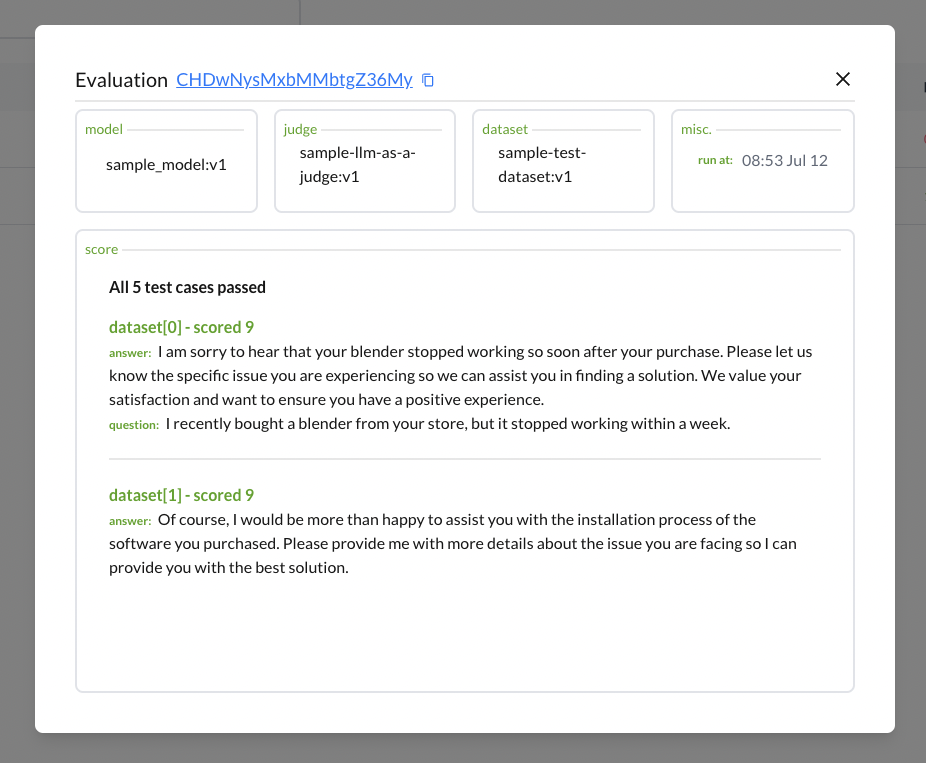

# Evaluations

Evaluations play a critical role in assessing the performance of a model against a predefined dataset. By systematically measuring a model's accuracy, we can gain valuable insights into its strengths and areas for improvement. In this section, we will guide you through the process of creating and understanding evaluations in our system.

## Creating an Evaluation
Evaluations are created using the `@bhb.assess` decorator. This decorator requires 2 parameters.
- `judge_tag`: the tag identifying the judge's scoring function
- `dataset_tag`: the tag identifying the dataset to be used for the evaluation

### Example Usage
To create an evaluation, simply call the `@bhb.assess` decorator with the appropriate tags:

```python
@bhb.assess(judge_tag='accuracy_scoring_judge:v1', dataset_tag='validation_set:v2')
def model():
    # Your model implementation here
    pass
model()
```
In this example, the evaluation uses the `accuracy_scoring_judge:v1` as the judge and the `validation_set` as the dataset. 
:::tip[Evaluation]
Evaluation are only calculated and created when you make a call to a model.
:::

## Understanding Evaluations
An evaluation measures how well a model performs against a predefined dataset by using a [judge component](./judge.md). This process involves comparing the model's predictions to the actual values in the dataset and calculating a performance score. 

### Components of an Evaluation 
1. **Judge component (`judge_tag`)**: this function defines the criteria for measuring the model's performance. You can also optionally include a passing function. Common scoring functions include accuracy, precision, recall, and F1-score. 
2. **Dataset(`dataset_tag`)**: the [dataset](./dataset.md) is a collection of data points used to evaluate the model. It typically includes input features and corresponding true labels. The `dataset_tag` parameter identifies which dataset to use for the evaluation.

### Viewing Evaluation Results
To view the results fo an evaluation, make a call to your model with the decorator and BigHummingbird will generate a detail link to the evaluation and take you to the dashboard. 
