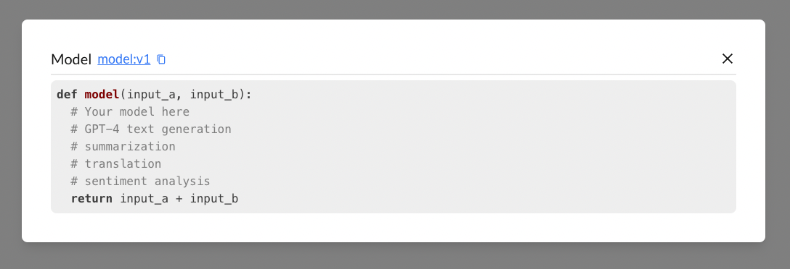
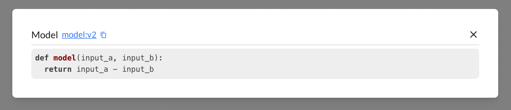

# Run

## Why do we want to trace model inference inputs and outputs?
In the lifecycle of model development and deployment, tracing every single inference input and output value is essential for several reasons. Whether you're int he experimental phase or deploying a production model, detailed tracing provides:
- **Debugging and Error Analysis**: Tracing inputs and outputs allows you to pinpoint exactly where a model might be failing or producing unexpected results.
- **Performance monitoring**: Continuous tracing helps monitor the model's performance in real-time. By analyzing the input and output data, you can detect performance degradation, anomalies, or drift, ensuring your model remains reliable over time.
- **Optimizing Model Performance**: By analyzing the traced inputs and outputs, you can identify patterns and trends that inform further optimizations. 
- **Handling Non-Deterministic Models**: Some models, particularly those that are non-deterministic, produce different outputs for the same input due to inherent randomness. Tracing every input and output is crucial for these models as it allows you to understand and quantify the variability in their behavior. 

## Tracing a model inference
BigHummingbird makes it simple to trace a model inference input and output values.

```python title="model.py"
from bighummingbird import BigHummingbird
bhb = BigHummingbird("Concept Project", API_KEY)
@bhb.trace
def model(input_a, input_b):
  # Your model here
  # GPT-4 text generation
  # summarization
  # translation
  # sentiment analysis
  return input_a + input_b

model(1, 2)
```

```bash
python model.py
```

**View runs and models on a dashboard**  



This will automatically track your model function signature, outputs, and the model definition. Any changes to these attributes will automatically trigger BigHummingbird to increment your model version. 

### Model Detection
- **New Model**: If the model is new, BigHummingbird will automatically create it for you.
- **Existing Model**: If the model already exists, BigHummingbird will recognize it and won't create a duplicate.

### Model Tagging
- Each model is assigned a unique identifier called the **Model Tag**
- The format for a Model Tag is `{model_name}:{version}`
- Model tags are unique to each project, ensuring that each model can be distinctly identified within its respective project.
- If the `{model_name}` is updated, a new model tag will be created and start from version: `v1`

Let's take a look at an example and update our model. 
```python
@bhb.trace
def model(input_a, input_b):
  return input_a - input_b # addition changed into subtraction
model(1, 2)
```

Notice how the model is now updated to `v2`. This is a model tag that you can reference at any time. This will come in handy when we want to pull out previous models and evaluate their performance before checking in our code.


## Evaluate model run performance
```python title="model.py"
from bighummingbird import BigHummingbird
from bighummingbird.judge import Judge

bhb = BigHummingbird("Quick Start", API_KEY)

def scoring_rubric(outputs):
    # This is important. All necessary imports must be done here.
    import random
    return random.randint(1, 10)

def passing_criteria(score):
    return score > 5

judge = Judge(
    "random-judge",
    "This judge will return a random score between 1 to 10",
    scoring_rubric,
    passing_criteria,
)
judge_tag = bhb.add_judge(judge)

@bhb.assess(judge_tag)
def model(input_a, input_b):
  # Your model here
  # GPT-4 text generation
  # summarization
  # translation
  # sentiment analysis
  return input_a + input_b
```
