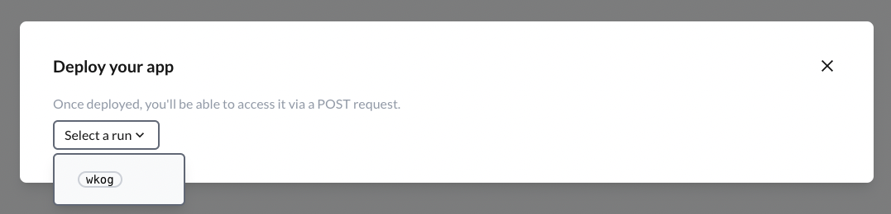

# Understanding Deployment
Once you've fine-tuned your prompt and it's performing to your satisfaction, the next step is to deploy it, making your language model available via a REST API. Big Hummingbird streamlines the deployment process, allowing you to turn your prompts into production-ready endpoints in just a few step.

## Select a run for deployment
A run includes the prompt messages and model configurations (model + model hyperparameter).



Once you've selected a run, click on `Launch`. Once deployed, you'll be able to access it via a POST request. 


Once your deployment succeeds, you can see your service available. 


## Sending post requests

Your prompt messages along with model configurations are available at the service url. 

### Javascript

```jsx title="javascript code to send a POST request to the model"
// You can find your service_url at the top of the deployment page.
const url = `{service_url}/generate`;

// These should be your (or your users') inputs to the prompt.
const inputs = [
    {key: `goal`, value: `drive conversions`},
    {key: `product name`, value: `EcoKitchen Starter Kit: The Ultimate Eco-Friendly Kitchen Set`}
];

async function sendRequest() {
    // Make the POST request
    const response = await fetch(url, {
        method: 'POST',
        headers: {
            'Content-Type': 'application/json'
        }, 
        body: JSON.stringify(inputs)
    });

    if (response.ok) {
        const data = await response.json();
        console.log('Success:', data);
    } else {
        console.error('Error:', response.status, response.statusText);
    }
}

sendRequest();
```

### Python

If you have a Python based server like FastAPI or Flask, you can make a request with the following code. 

**1. Set you virtual environment (recommended)**

```python
python -m venv .venv
source .venv/bin/activate
```

**2. Make the POST request**
```python
import requests
import json

# You can find your service_url on the top of the deployment page.
url = f'{service_url}/generate'

# These should be your (or your users') inputs to the prompt.
inputs = [
    {"key": "goal", "value": """drive conversions"""},
    {"key": "product name", "value": """EcoKitchen Starter Kit: The Ultimate Eco-Friendly Kitchen Set"""}
]

# Make the POST request
response = requests.post(
    url,
    headers={'Content-Type': 'application/json'}, 
    data=json.dumps(inputs)
)

if response.ok:
    data = response.json()
    print('Success:', data)
else:
    print('Error:', response.status_code, response.reason)

```

## Deployment logs
For each engine, you can choose one run to deploy. All past deployments will live in the deployment logs section.
