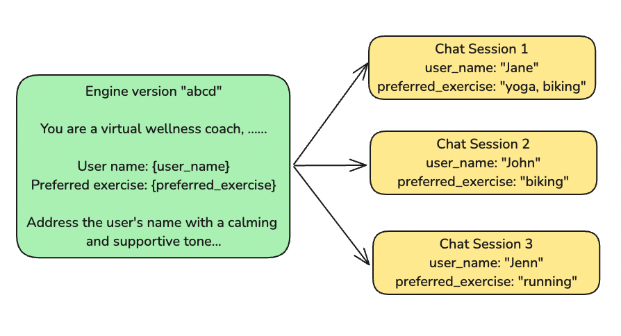

# Chat Session

A chat session is a distinct conversation instance that consists of three main components:
- [**Messages**](./messages.md): An array of `Message` type objects, where each message contains:
    - **Role**: Defines the speaker of the message and can be one of the following: `system`, `user`, or `assistant`.
    - **Content**: A string containing the text of the message. 
    In most cases, chat sessions begin with a single message from the `system` role. However, in scenarios such as few-shot prompting, the session may also include `user` and `assistant` role messages to provide examples of itneraction.

- **Model Configuration**: The specific settings or parameters that define how the model behaves during the session.
- [**Variables**](./variables.md): Custom values that personalize the session, such as user-specific data or chat session-specific context.

You can create multiple chat sessions from a specific [engine](./intro.md) version. Each session has its own set of variables, enabling you to tailor the initial setup for different use cases. 

## Chat Sessions: Wellness Coach Chatbot Example



This guide will show you how to set up a wellness coach chatbot that provides personalized, uplifting conversations. The chatbot uses simple information about the user to create a unique experience for each person. 

### How It Works

The chatbot is designed to encourage users with mindfulness tips and motivational support. It can great users by name and give advice based on their favorite exercise. Here's how it starts: 

1. Message Setup

```text
Role: "system"
Message: "
You are a virtual wellness coach, providing users with mindfulness tips and motivational encouragement. 
You have access to the following information, your responses are based on general wellness principles.

User name: {user_name}
Preferred exercise: {preferred_exercise}

Address the user's name with a calming and supportive tone in your responses. 
Your goal is to help users feel better and encourage them in their wellness journey. 
"
```
In this setup: 
- The chatbot uses the user's name to make the conversation feel personal. 
- It adjusts its advice based on the user's favorite exercise, like running or yoga, to give them relevant tips. 
- The tone is always calm and encouraging, helping users feel supported. 

2. Initialize chat sessions with variables
The chatbot uses two main pieces of information (variables) to create personalized chat sessions:

user_name – This is the user's name, so the chatbot can address them directly.
preferred_exercise – The user’s favorite exercise, which could be anything from yoga to swimming, to tailor the responses.

### Making Each Chat Session Unique

You can change these variables to create different chat experiences. For example, if a user prefers meditation instead of running, the chatbot will provide responses that fit that choice. Variables can be setup when you create the chat session. See [deployment](../deployment/intro.md) for more information. 

