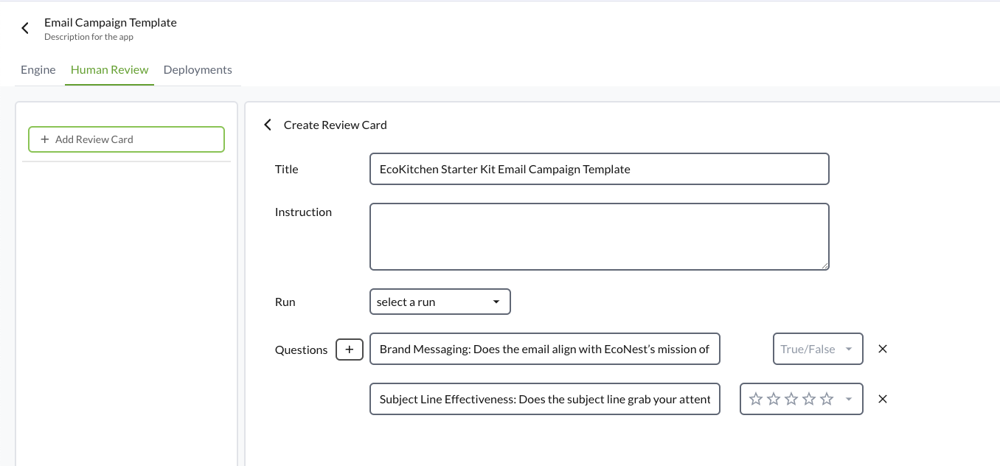
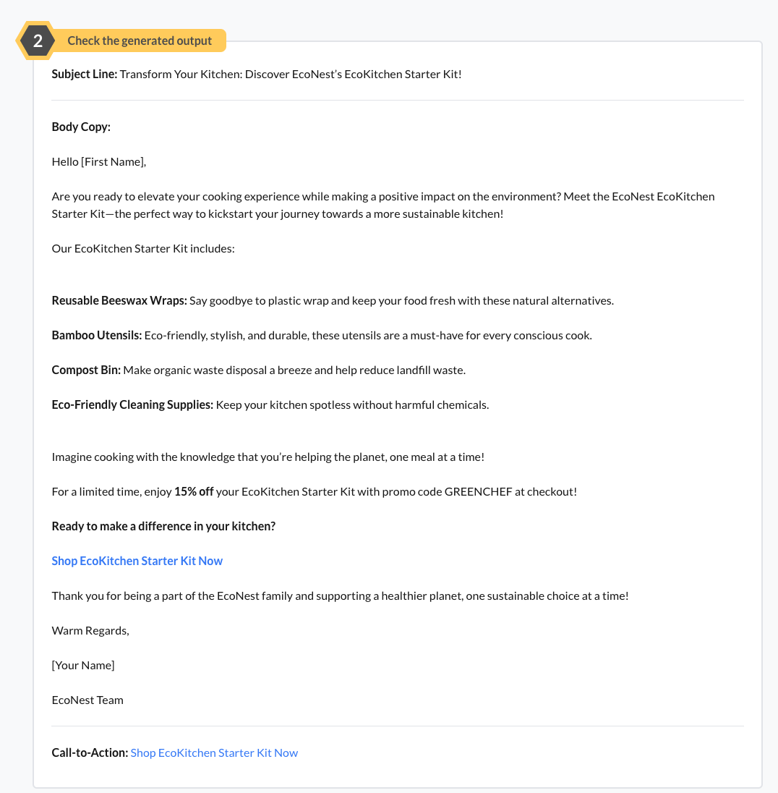
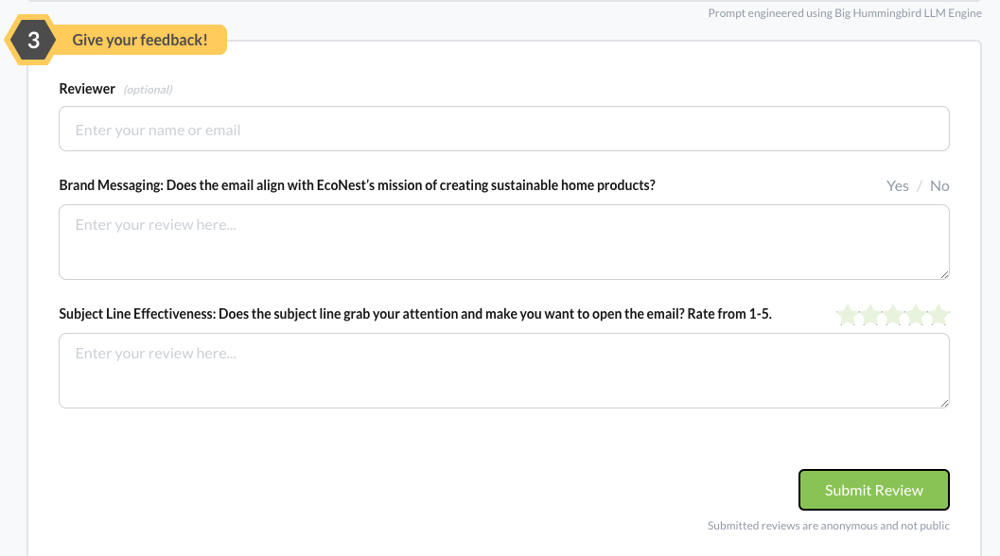

# Evaluations Key Concepts

### Evaluating the LLM
One of the key features of Big Hummingbird is the ability to incorporate human feedback in evaluating the effectiveness of your AI-generated outputs. 

### Create an Evaluation Card

In the `Human Review` section, you can set up review criteria for the prompt. Evaluation cards allow you to define specific questions regarding "Conciseness", "Relevance", or "Tone", and provide a rating scale (from 1 to 5 stars) or True/False. 

For our example, we'll include the following questions: 
- Brand Messaging: Does the email align with EcoNest’s mission of creating sustainable home products?
- Subject Line Effectiveness: Does the subject line grab your attention and make you want to open the email? Rate from 1-5.

### Invite Human Reviewers 

You can invite team members or domain experts to review prompt outputs. Human reviewers will score the output based on the criteria defined in the valuation card, providing qualitative feedback. 

What your reviewers see.

### Review Feedback

After the human reviewers have completed their assessments, you can see their ratings and comments. This feedback is crucial for refining your prompts and ensuring that the outputs meet your project's goals. 