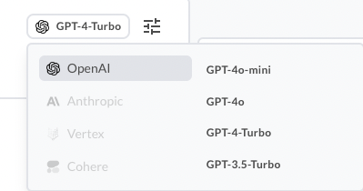
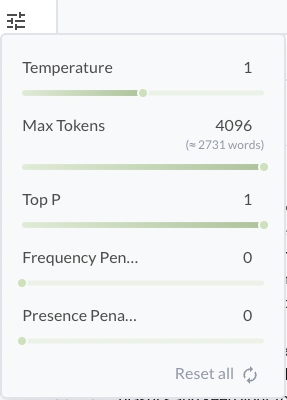
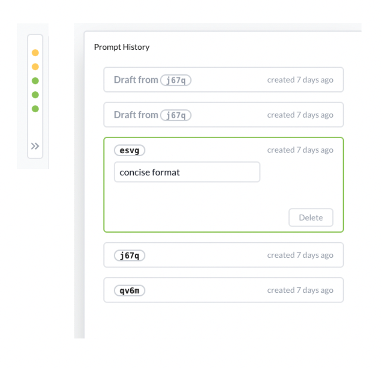
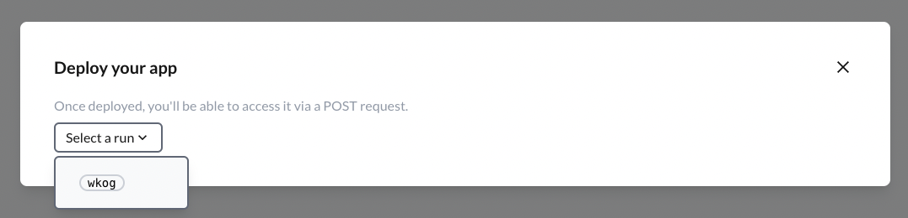

# Quick start
Big Hummingbird is a LLM platform born from the need to help software engineers develop LLM applications with best practices in mind. It streamlines everything from prompt management and engineering to evaluating and deploying LLM applications.

# Quick Start
First, [sign in](https://www.bighummingbird.com/signin) or [create a new account](https://www.bighummingbird.com/signin) if you haven't already. 

Once you're logged in, it's time to set up a new engine. The engine will serve as your workspace, where you'll iterate on prompts and manage deployments for your projects.

In this engine, we'll craft a prompt for an AI email marketing assistant. Here's how to set it up:
### Step-by-Step
1. **Create Prompt**
2. **Configure Model**
3. **Create New Chat Session**
4. **Manage Prompts**
5. **Deploying**

--- 

## 1. Create Prompt
Create a new engine on your dashboard and in the engine area, create the following prompt messages

- **Role**: System
- **Message**:
```text

You are a virtual wellness coach, providing users with mindfulness tips and motivational encouragement. You have access to the following information, your responses are based on general wellness principles.

User name: {user_name}
Preferred exercise: {preferred_exercise}

Address the user's name with a calming and supportive tone in your responses. Your goal is to help users feel better and encourage them in their wellness journey. 

```

Notice how we've used `{user_name}` and `{preferred_exercies}` in the message itself. These variables are optional and are designed to help you parameterize your messages for greater flexibility and reusability. 

:::tip[message roles]
For more information on how to choose `role`s, see [message roles](../engine/intro.md#prompt-section)
:::

--- 


## 2. Configure model (optional)

At this stage, you can also configure the model's parameters to fine-tune its behavior.





--- 

## 3. Create a new chat session

Click on `Create a new chat session` and start chatting with your chatbot! Your chatbot is now configured with your prompt and model.

--- 

## 4. Manage prompts
In Big Hummingbird, managing prompts is simple and designed to help you stay organized while experimenting and iterating. 

**Edit Existing Prompts**: You can easily update your prompts as you iterate. All *runs* (whenever you click on run) are versioned. Each version contains the prompt message, selected model, and corresponding model hyperparamters so you can easily track what worked and what didn't work. 

Big Hummingbird also automatically tracks the lineage of your draft engine state if you haven't "run" the model yet. 



---

## 5. Deploying
Once you've fine-tuned your prompt and it's performing to your satisfaction, the next step is to deploy it, making your language model available via a REST API. Big Hummingbird streamlines the deployment process, allowing you to turn your prompts into production-ready endpoints in just a few step. 

### Select a run for deployment
A run includes the prompt messages and model configurations (model + model hyperparameter).



Once you've selected a run, click on `Launch`.

Once your deployment succeeds, you can see your service up and running.

### Sending POST requests

And that's it! Your prompt messages along with model configurations are available at the service url. Check out [Deployment Endpoint Specs](../deployment/endpoint_specs.md) for how to initialize your chat session and invoking the LLM.


