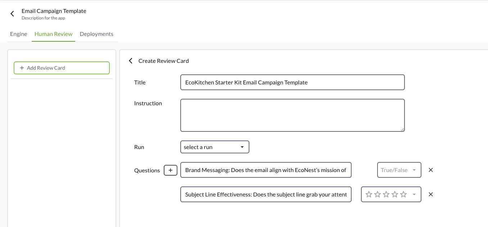
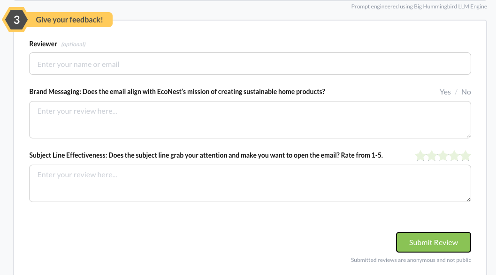
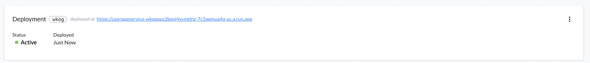

# Quick start
Big Hummingbird is a LLM platform born from the need to help software engineers develop LLM applications with best practices in mind. It streamlines everything from prompt management and engineering to evaluating and deploying LLM applications.

# Quick Start
First, [sign in](https://www.bighummingbird.com/signin) or [create a new account](https://www.bighummingbird.com/signin) if you haven't already. 

Once you're logged in, it's time to set up a new engine. The engine will serve as your workspace, where you'll iterate on prompts and manage deployments for your projects.

In this engine, we'll craft a prompt for an AI email marketing assistant. Here's how to set it up:
### Step-by-Step


#### 1. Create a new engine on your dashboard and in the engine area, create the following prompt messages

- **Role**: System
- **Message**:
```text
You are a technical support assistant for a software product. Your primary role is to assist users by providing accurate, concise, and helpful information based on the context provided. 

When a user asks a question, first refer to the Context provided, then generate a clear and friendly response that directly addresses the user's query. If there are no Context provided and the issue is complex, kindly suggest reaching out to human support. 
```

- **Role**: User
- **Message**:
```text
I need an email campaign targeting our {target audience}.
The campaign should promote our {product name}.
```


Notice how we've used `{goal}` in the message itself. These variables are optional and are designed to help you parameterize your messages for greater flexibility and reusability. 

:::tip[message roles]
For more information on how to choose `role`s, see [message roles](../engine/intro.md#prompt-section)
:::


#### 2. Configure your model (optional)

At this stage, you can also configure the model's parameters to fine-tune its behavior.


#### 3. Run your prompt through the model

Click on `run` and observe the output. 

### Manage prompts
In Big Hummingbird, managing prompts is simple and designed to help you stay organized while experimenting and iterating. 

**Edit Existing Prompts**: You can easily update your prompts as you iterate. All *runs* (whenever you click on run) are versioned. Each version contains the prompt message, selected model, and corresponding model hyperparamters so you can easily track what worked and what didn't work. 

Big Hummingbird also automatically tracks the lineage of your draft engine state if you haven't "run" the model yet. 


### Evaluating the LLM
One of the key features of Big Hummingbird is the ability to incorporate human feedback in evaluating the effectiveness of your AI-generated outputs. 

#### 1. Setting up Evaluation Cards
In the `Human Review` section, you can set up review criteria for the prompt. Evaluation cards allow you to define specific questions regarding "Conciseness", "Relevance", or "Tone", and provide a rating scale (from 1 to 5 stars) or True/False. 



For our example, we'll include the following questions: 
- *Brand Messaging: Does the email align with EcoNest’s mission of creating sustainable home products? True/False*
- *Subject Line Effectiveness: Does the subject line grab your attention and make you want to open the email? Rate from 1-5.*

#### 2. Invite your team, domain experts, or your users: 
You can invite team members or domain experts to review prompt outputs. Reviewers will score the output based on the criteria defined in the valuation card, providing qualitative feedback. 

What your reviewers see.




#### 3. Review Feedback: 
After your reviewers have completed their assessments, you can see their ratings and comments. This feedback is crucial for refining your prompts and ensuring that the outputs meet your project's goals. 


### Deploying the LLM
Once you've fine-tuned your prompt and it's performing to your satisfaction, the next step is to deploy it, making your language model available via a REST API. Big Hummingbird streamlines the deployment process, allowing you to turn your prompts into production-ready endpoints in just a few step. 

## Select a run for deployment
A run includes the prompt messages and model configurations (model + model hyperparameter).


Once you've selected a run, click on `Launch`.


Once your deployment succeeds, you can see your service up and running.



## Sending post requests

And that's it! Your prompt messages along with model configurations are available at the service url. You can now send a POST request to the `/generate` endpoint. 
For more details, check out [Deployment](../deployment/deployment.md#sending-post-requests)


