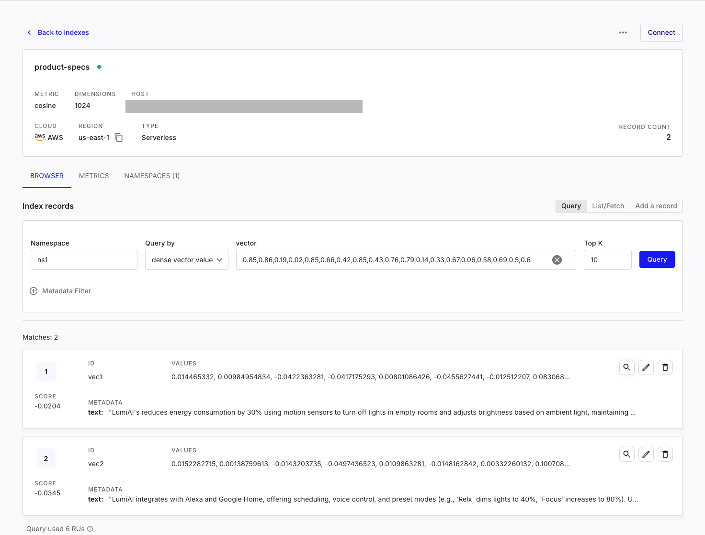
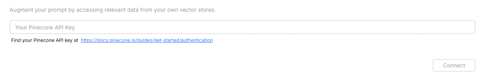
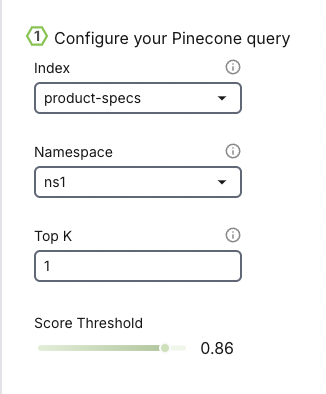
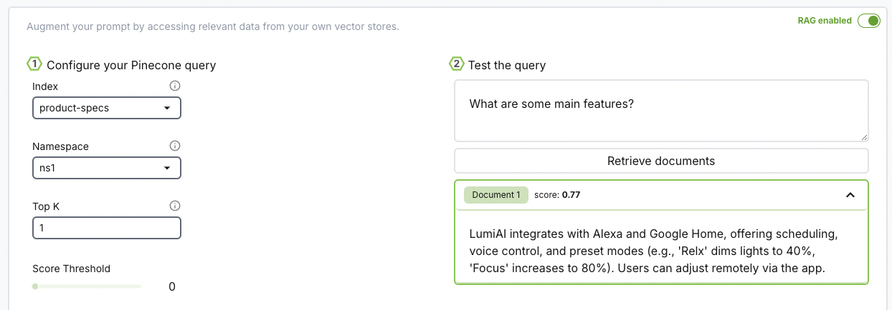
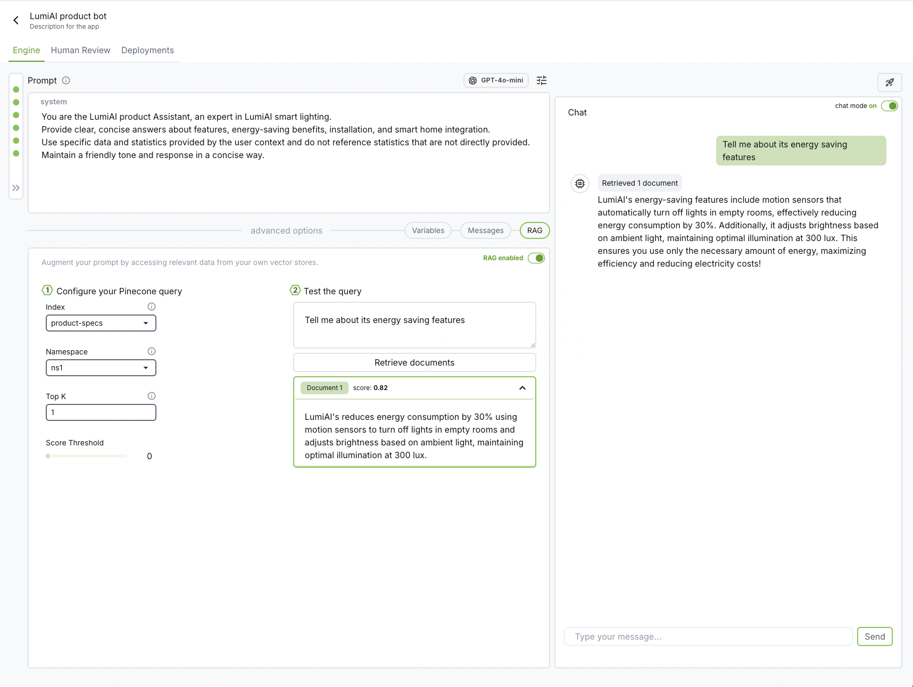
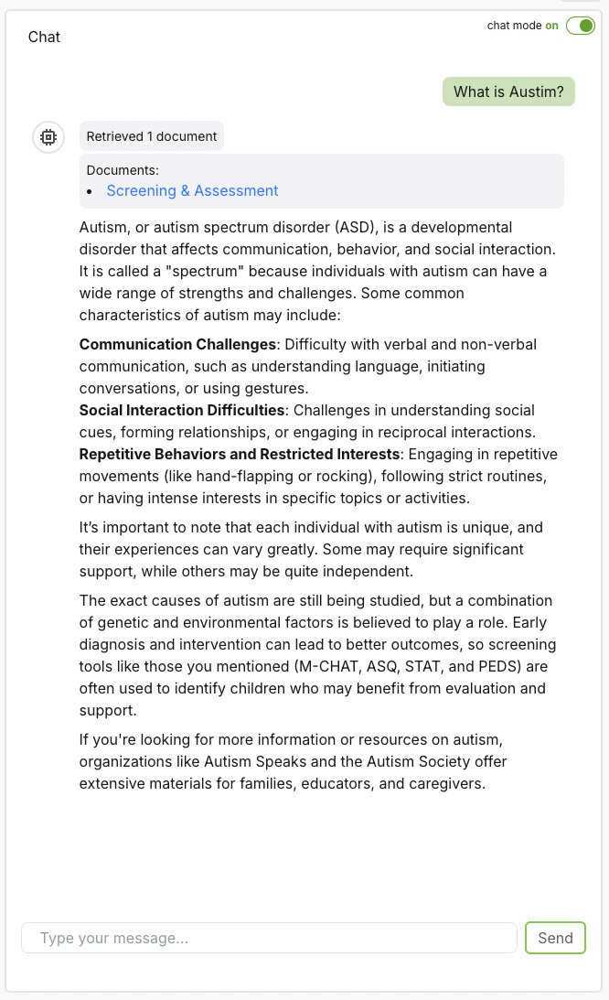
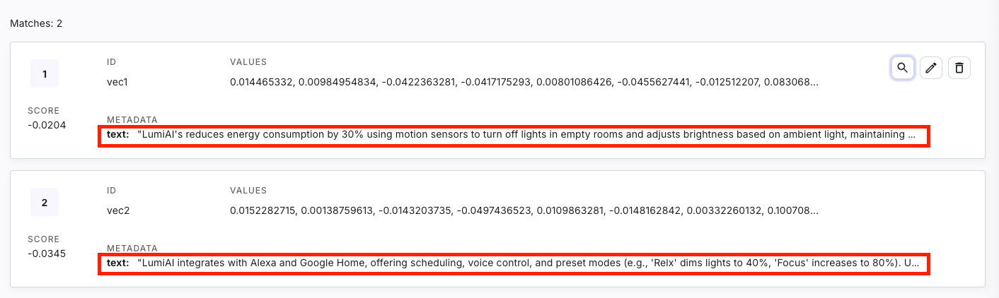

# Build a RAG Chat

<iframe
  allow="fullscreen"
  src="https://player.vimeo.com/video/1014914526?badge=0&transparent=1&autopause=0&player_id=0&app_id=58479&controls=0&autoplay=1&loop=1&muted=1"
  className="h-[600px] w-full"
  title="Develop Segment Video"
></iframe>

## How does it work
Retrieval-Augmented Generation (RAG) is a method that boosts language models by combining them with an external knowledge base, making responses more accurate and relevant. 

To illustrate how this works, let's imagine we're building a chatbot for a fictional product called LumiAI. Even though LumiAI doesn't exist in the model's training data, we can make our chatbot respond effectively by adding specific information about it.

Here's how RAG makes it possible:
1. **Retriever**: The retriever fetches useful information from a knowledge base or document storage. For our LumiAI example, we add records that describe the product's features and capabilities. A vector database stores this information as embeddings—numerical representations that capture the essence of the content. The embeddings are created using an embedding model and allow the retriever to quickly find information that matches a user's query, like "What are LumiAI's main features?".

2. **Generator**: Once the relevant information about LumiAI is retrieved, the generator (a language model) uses it to create a detailed response. This means if someone asks about LumiAI, the chatbot grounds its answer in the added context, resulting in accurate and informative replies—even for a product that wasn't originally in its training data. 

## Let's Get Started!
Now that you understand how RAG works, we'll guide you through creating the sample records for LumiAI and setting up the retriever and generator components. By the end of this tutorial, you'll have a working chatbot that can handle questions about LumiAI, showcasing the power of Retrieval-Augmented Generation in action.

First, [sign in](https://www.bighummingbird.com) or [create a new account](https://www.bighummingbird.com) if you haven't already.

Once you're logged in, it's time to set up a new engine. The engine will serve as your workspace, where you'll iterate on prompts and manage deployments for your projects.

## Prep your vector database (with Pinecone)
### 1. Set up your environment

Obtain a [Pinecone API key](https://docs.pinecone.io/guides/get-started/quickstart) for index creation

### 2. Store knowledge in Pinecone
#### a. Create a Pinecone serverless index
```python
from pinecone.grpc import PineconeGRPC as Pinecone
from pinecone import ServerlessSpec

pc = Pinecone(api_key="YOUR_API_KEY")

pc.create_index(
  name="product-specs", # This can be any name you want.
  dimension=1536,
  metric="cosine",
  spec=ServerlessSpec(
    cloud="aws",
    region="us-east-1"
  ),
  deletion_protection="disabled"
) 
```
See [Pinecone: Create an index](https://docs.pinecone.io/guides/indexes/create-an-index#create-a-serverless-index) for other types of indexes.

#### b. Embed data
In this tutorial, we'll create two sample records for a fictional product called LumiAI. This example will demonstrate how the chatbot can effectively answer questions about LumiAI, even though it wasn't part of the original training data. 

```python
data = [
    {"id": "vec1", "text": "LumiAI's reduces energy consumption by 30% using motion sensors to turn off lights in empty rooms and adjusts brightness based on ambient light, maintaining optimal illumination at 300 lux."},
    {"id": "vec2", "text": "LumiAI integrates with Alexa and Google Home, offering scheduling, voice control, and preset modes (e.g., 'Relx' dims lights to 40%, 'Focus' increases to 80%). Users can adjust remotely via the app."},
]

embeddings = pc.inference.embed(
    "multilingual-e5-large",
    inputs=[d['text'] for d in data],
    parameters={
        "input_type": "passage"
    }
)

vectors = []
for d, e in zip(data, embeddings):
    vectors.append({
        "id": d['id'],
        "values": e['values'],
        "metadata": {'text': d['text']}
    })
```
#### c. Upsert data
```python
index = pc.Index(index_name)
index.upsert(
    vectors=vectors,
    namespace="ns1" # This can be anything you want. Let's just put ns1 short for namespace1 for now.
)
```
And that's it! You should now see the records added to the namespace on Pinecone's dashboard. 


## Create an Engine
### 1. Add system prompt

```text
You are the LumiAI product Assistant, an expert in LumiAI smart lighting. 
Provide clear, concise answers about features, energy-saving benefits, installation, 
and smart home integration. 
Use specific data and examples, maintaining a friendly and professional tone.
```
### 2. Connect Big Hummingbird to Pinecone

Connect to your Pinecone vector database via Pinecone API key. The API key identifies the specific project you wish to access.

Once you're connected, set up your query configuration. 



#### Index
- An index in Pinecone is where data is stored and organized for efficient similarity search.
- We can think of an index as a dedicated database designed to manage and quickly find relevant information using vector-based queries. 

#### Namespace
- A namespace is a logical grouping within an index that acts like a sub-index or category.
- It allows us to segment data logically without creating separate indexes. For example, you could store vectors representing different data types (e.g. "product department" and "marketing department") in separate namespaces.

#### TopK
- The TopK parameter refers to the number of nearest neighbor vectors that should be returned by the retrieval system for each query.

#### Score Threshold
- The score threshold is a cutoff value that determines whether a similarity score between the query vector and a candidate vector is significant enough to be included in the results.

Once we have our configuration set up, we can test our retrieval system by giving a test user query and observe the records retrieved. Each record has a "score" associated with it to help with tweaking the score threshold. 


:::tip
Don't see your vector database? Leave us a message to get your vector database added to our roadmap :)
:::

### 3. Create a chat session
Click on `Create a new chat session` and start chatting with your chatbot! Your chatbot is now configured with your prompt, records, and model. 



:::tip
For high-accuracy scenarios, such as medical or legal applications, consider including reference links in your records. To do this, add `title` and `link` fields to the record metadata, allowing references to appear directly in the chat session for review. 
:::




### 4. Deploy

Once you're happy with your setup? Deploy your chatbot as a RESTful endpoint and integrate into your application. 
Check [Deployment](../deployment/intro.md) for endpoint specs


## Debugging Tips

### There is an error when creating a chat session with RAG enabled
Big Hummingbird retrieves content from individual records from the `text` field. This is also the default key Pinecone provides. Verify on Pinecone's dashboard that you have the text you want to embed under the `text` field.



