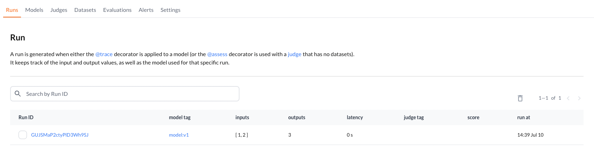
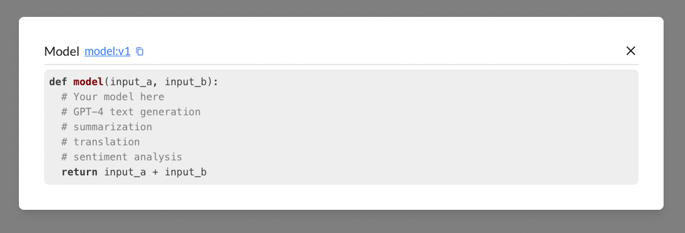
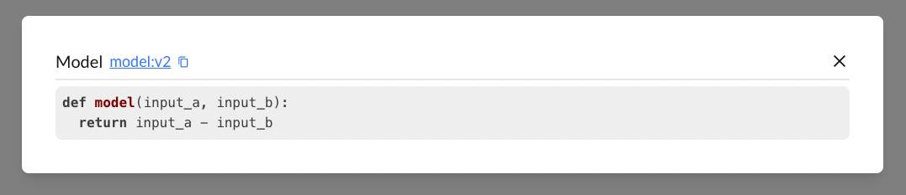

# What is BigHummingbird
BigHummingbird is a simple toolbox to help speed up your LLM projects during experimental phase so you can focus on the tweaking and not the tracking and get your models to production faster. 

## 5 minute quick start  
It takes just a couple lines to get started. Try it on your local machine or start with one of our
[Google Colab Quickstart](https://colab.research.google.com/drive/1bKd5OZdFtC5a1SpXvp1FxRdVsgdf9M26#scrollTo=xSAJTLv6GBGc)

**Install bighummingbird python package**
```bash
pip install bighummingbird
```

**Initialize your project**  
:::tip[API Key]
You can get your API_KEY at www.bighummingbird.com Workspace > Settings > Create New API Key
:::

```python
from bighummingbird import BigHummingbird
bhb = BigHummingbird("My awesome project", API_KEY)
```

**Decorate whichever model you want to track**  

```python title="model.py"
# Add the trace decorator
@bhb.trace
def model(input_a, input_b):
  # Your model here
  # GPT-4 text generation
  # summarization
  # translation
  # sentiment analysis
  return input_a + input_b

model(1, 2)
```

```bash
python model.py
```
**View runs and models on a dashboard**  



This will automatically track your model function signature, outputs, and the model definition. Any changes to these attributes will automatically trigger BigHummingbird to increment your model version. 

Let's take a look at an example and update our model. 
```python
# Add the trace decorator
@bhb.trace
def model(input_a, input_b):
  return input_a - input_b # addition changed into subtraction
model(1, 2)
```

Notice how the model is now updated to `v2`. This is a model tag that you can reference at any time. This will come in handy when we want to pull out previous models and evaluate their performance before checking in our code.

## Next steps  
- Learn how to add a custom judge with your own test dataset to [evaluate your model performance](./quick_start/evaluating_model.md). 
- Learn how to add [LLM-as-a-judge with OpenAI](./quick_start/llm_as_a_judge.md)