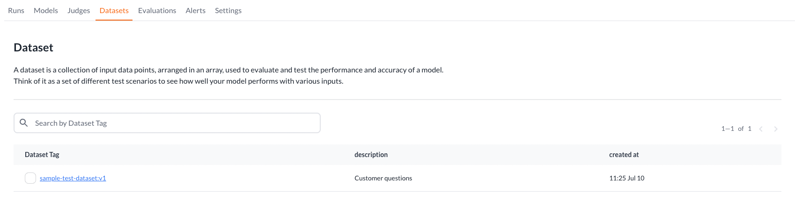
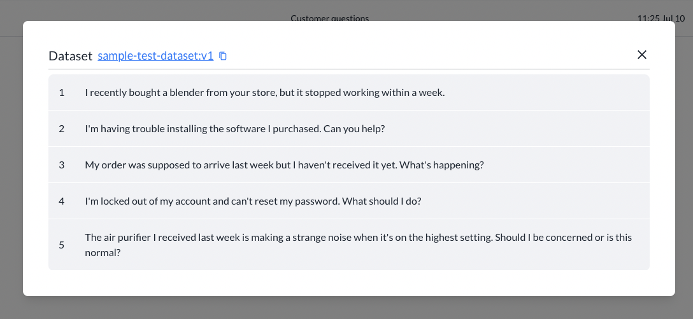
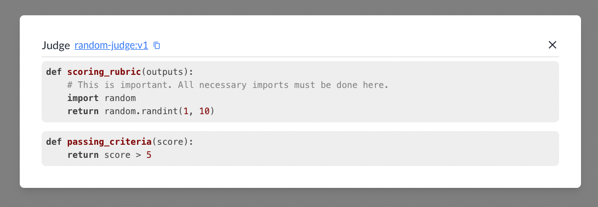
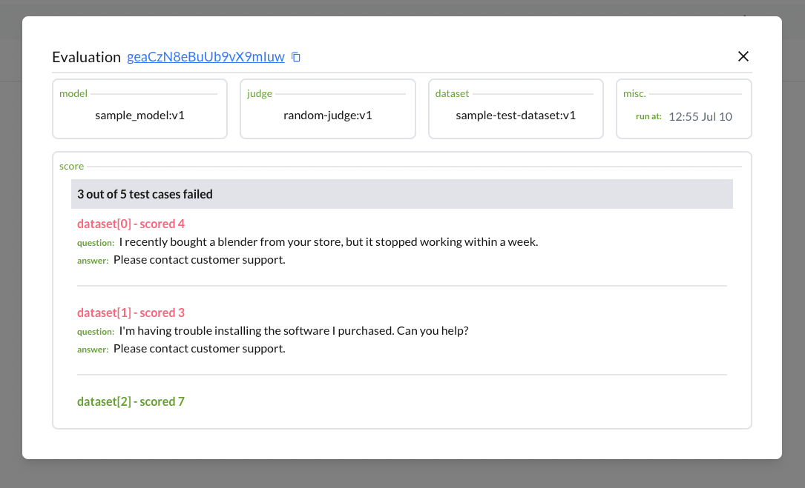

# Evaluating your model 
Imagine that you're creating a model that crafts responses for customer support and you want to know how your model performs against a fixed set of data points. 

## Define your own dataset
### Initialize your project
**Install bighummingbird python package**
```bash
pip install bighummingbird
```
In your python code, create an instance of `Bighummingbird`. 

:::tip[API Key]
You can get your API_KEY at www.bighummingbird.com/settings
:::
:::tip[Don't want to expose your API_KEYs?]
You can store your API_KEYs in your local `.env` file for security. See securely store your API_KEYs for more information.
:::

```python
from bighummingbird import BigHummingbird
bhb = BigHummingbird(API_KEY)
```

### Create a static model
To begin with, we'll create a static model that returns the same response for any input. Let's say the model just returns "What do you mean?", which is not a very good response! Let's see how we can evaluate the performance of this model. 

```python
def sample_model(question):
    # Feel free to swap this out to use your custom LLM model.
    return {
        "question": question,
        "answer:: "What do you mean?",
    }
```

### Create your dataset
`Dataset` is a collection of only input data points, arranged in an array.

```python
from bighummingbird.dataset import Dataset
customer_questions = [
    'I recently bought a blender from your store, but it stopped working within a week.',
    'I\'m having trouble installing the software I purchased. Can you help?',
    'My order was supposed to arrive last week but I haven\'t received it yet. What\'s happening?',
    'I\'m locked out of my account and can\'t reset my password. What should I do?',
    'The air purifier I received last week is making a strange noise when it\'s on the highest setting. Should I be concerned or is this normal?'
]

dataset = Dataset("sample-test-dataset", data=customer_questions, description="Customer questions")
dataset_tag = bhb.upload_dataset(dataset)
```

### Upload your dataset
```python
dataset_tag = bhb.upload_dataset(dataset)
```

### View your dataset on the dashboard. 
Variable `dataset_tag` will be how you reference this particular dataset. In this example, it is `sample-test-dataset:v1`




### How the dataset is versioned?
Any changes to the inputs, whether the value or the structure will automatically trigger a version update. Check [Dataset](../concepts/dataset.md) for more information.


## Create your own judge
A `Judge` consists of a scoring function that assigns a numeric score to the outputs. 

### Define your scoring function
A `scoring_function` is a function that takes your model outputs, and give them a numeric score. 
```python
def scoring_rubric(output):
    import random
    return random.randint(1, 10)
```
:::tip[Tip]
Notice how `import random` is added within a function. This is important because we track the entire function definition and run it against the model later on. If you have any dependencies, you must import it within the function. 
:::

In this example, the scoring rubric simply gives out a score between 1 to 10. Not very helpful in evaluating our model, but this fine for our demo purpose. To see how we could use LLM-as-a-judge to evaluate our model, see [LLM-as-a-judge with OpenAI](./llm_as_a_judge.md)

### Define your passing criteria (optional)

Taken the score from `scoring_rubric`, you can define a passing or failing threshold so that you can visually see your model's performance on the dashboard. 
```python
def passing_criteria(score):
    return score > 5
```

You can also define `passing_criteria` as a range like. Just make sure that the output is a `bool` type.

```python
def passing_criteria(score):
    return 5 < score and score < 9
```

### Put scoring function and passing criteria together
```python
from bighummingbird.judge import Judge
judge = Judge(
    "random-judge",
    "This judge will return a random score between 1 to 10",
    scoring_rubric,
    passing_criteria,
)
```
and add upload the judge to bighummingbird
```python
judge_tag = bhb.add_judge(judge)
```


## Perfect!
Now we can run our model and view the evaluation score on bighummingbird dashboard!

```python title="sample_model.py"
@bhb.assess("random-judge:v1", "sample-test-dataset:v1")
def sample_model(question):
    return {
        "question": question,
        "answer": "What do you mean?"
    }
    
sample_model("I recently bought a blender from your store, but it stopped working within a week.")
```
Run the modal
```bash
python sample_model.py
```

```bash
✔ Project set to: Customer support project

=== Start of Evaluation ===

✖ sample-test-dataset[0] score: 4
✖ sample-test-dataset[1] score: 3
✔ sample-test-dataset[2] score: 7
✖ sample-test-dataset[3] score: 5
✔ sample-test-dataset[4] score: 8

✖ 3 out of 5 failed.

=== End of Evaluation ===

✔ Model sample_model:v1 uploaded.
```


## Putting everything together
```python
from bighummingbird import BigHummingbird
from bighummingbird.judge import Judge
from bighummingbird.dataset import Dataset

bhb = BigHummingbird(API_KEY)

customer_questions = [
    'I recently bought a blender from your store, but it stopped working within a week.',
    'I\'m having trouble installing the software I purchased. Can you help?',
    'My order was supposed to arrive last week but I haven\'t received it yet. What\'s happening?',
    'I\'m locked out of my account and can\'t reset my password. What should I do?',
    'The air purifier I received last week is making a strange noise when it\'s on the highest setting. Should I be concerned or is this normal?'
]

dataset = Dataset("sample-test-dataset", data=customer_questions, description="Customer questions")
dataset_tag = bhb.upload_dataset(dataset)

def scoring_rubric(outputs):
    import random
    return random.randint(1, 10)

def passing_criteria(score):
    return score > 5

judge = Judge(
    "random-judge",
    "This judge will return a random score between 1 to 10",
    scoring_rubric,
    passing_criteria,
)
judge_tag = bhb.add_judge(judge)

@bhb.assess(judge_tag, dataset_tag)
def sample_model(question):
    return {
        "question": question,
        "answer": "What do you mean?"
    }
sample_model("This is a test question")
```
## Next steps
- Learn how to add [LLM-as-a-judge with OpenAI](./llm_as_a_judge.md)